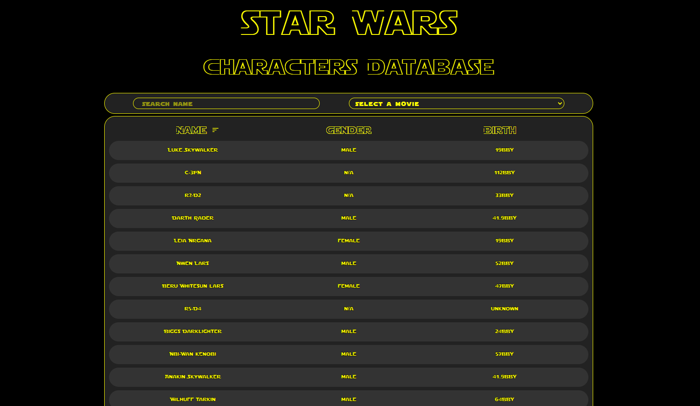
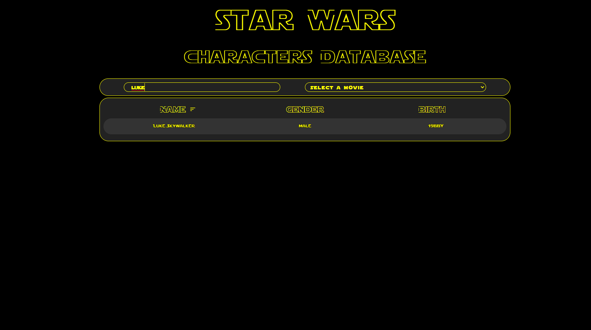
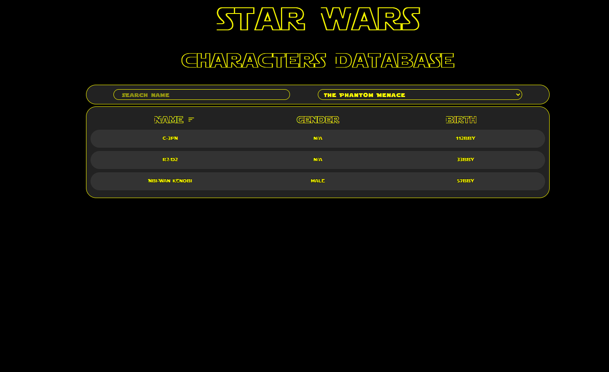

# StarWars Characters Database

This project was created as part of a recruitment task. The main task of the site is to fetch data from the [star wars api](https://swapi.dev) and present it in the form of a table. Additionally, the user is able to sort and filter the displayed data.

I used the following technologies/tools in the project:
- React
- Redux
- TypeScript
- Sass

ScreenShots:

There is also Infinite Scroll implemented:

